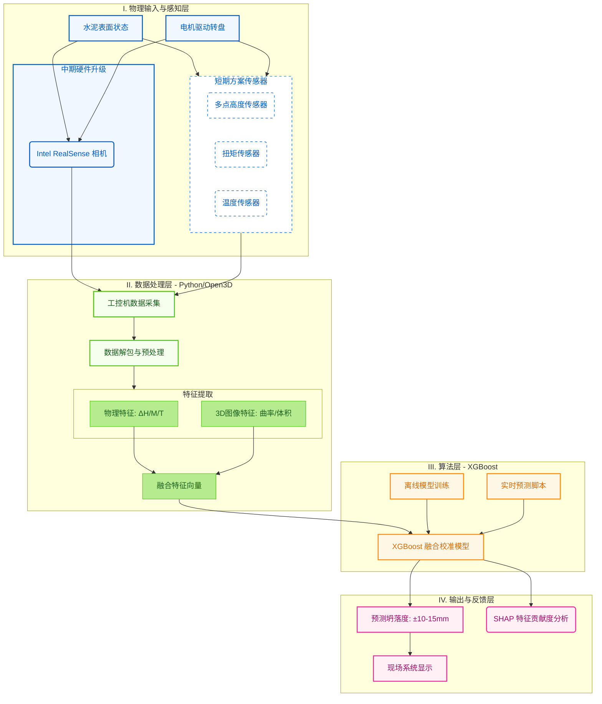

# 旋转离心坍落度测定仪中期改进方案系统框架图

此框架图展示了从硬件感知到机器学习融合预测的完整技术路线。

```mermaid
graph TD
    %% 1. 定义全局样式
    classDef hardware fill:#f0f7ff,stroke:#005cc5,stroke-width:2px,color:#005cc5;
    classDef legacy fill:#ffffff,stroke:#005cc5,stroke-width:1px,stroke-dasharray: 5 5,color:#005cc5;
    classDef software fill:#f6ffed,stroke:#52c41a,stroke-width:2px,color:#1b5e20;
    classDef feature fill:#b7eb8f,stroke:#52c41a,color:#1b5e20;
    classDef model fill:#fff7e6,stroke:#fa8c16,stroke-width:2px,color:#d46b08;
    classDef result fill:#fff0f6,stroke:#eb2f96,stroke-width:2px,color:#9e1068;

    %% 2. 物理输入与感知层
    subgraph I_Phys [I. 物理输入与感知层]
        I_Target[水泥表面状态]:::hardware
        I_Motor[电机驱动转盘]:::hardware
        
        subgraph I_LegSens [短期方案传感器]
            I_S1(多点高度传感器)
            I_S2(扭矩传感器)
            I_S3(温度传感器)
        end
        
        subgraph I_UpCam [中期硬件升级]
            I_Cam(Intel RealSense 相机)
        end
    end

    %% 3. 数据处理层
    subgraph II_Data [II. 数据处理层 - Python/Open3D]
        II_PC[工控机数据采集]:::software
        II_Proc[数据解包与预处理]:::software
        
        subgraph II_Feat [特征提取]
            II_F1[物理特征: ΔH/M/T]:::feature
            II_F2[3D图像特征: 曲率/体积]:::feature
        end
        II_Fusion[融合特征向量]:::feature
    end

    %% 4. 算法模型层
    subgraph III_Algo [III. 算法层 - XGBoost]
        III_Train[离线模型训练]:::model
        III_Script[实时预测脚本]:::model
        III_Final[XGBoost 融合校准模型]:::model
    end

    %% 5. 输出层
    subgraph IV_Out [IV. 输出与反馈层]
        IV_Disp[现场系统显示]:::result
        IV_Val[预测坍落度: ±10-15mm]:::result
        IV_SHAP(SHAP 特征贡献度分析):::result
    end

    %% 6. 逻辑连接
    I_Target & I_Motor --> I_Cam & I_LegSens
    I_Cam & I_LegSens --> II_PC
    II_PC --> II_Proc --> II_Feat
    II_F1 & II_F2 --> II_Fusion
    II_Fusion --> III_Final
    III_Train --> III_Final
    III_Script --> III_Final
    III_Final --> IV_Val
    IV_Val --> IV_Disp
    III_Final --> IV_SHAP

    %% 7. 应用嵌套样式
    class I_LegSens,I_S1,I_S2,I_S3 legacy;
    class I_UpCam,I_Cam hardware;
```
